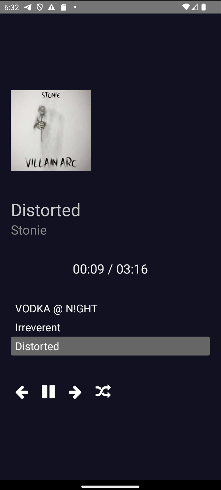
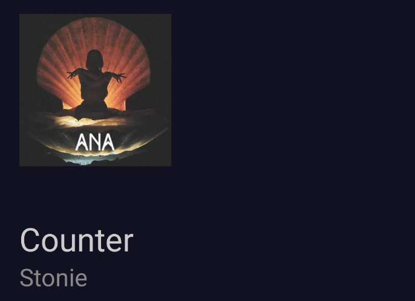
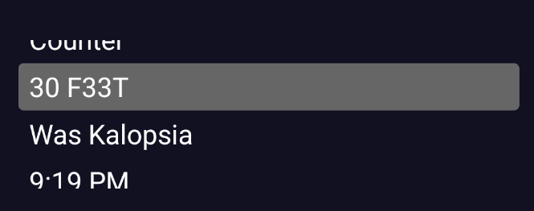

# React Native Music Player

This is a simple music player app built using React Native and the `react-native-track-player` library. It allows users to play, pause, skip tracks, shuffle the playlist, and view track progress.

[Download Demo](/app-debug.apk)

## Features
- Play, pause, skip to the previous/next track.
- Shuffle the playlist to enjoy a randomized listening experience.
- Display track progress with a formatted time indicator.
- View album cover, song title, and artist information.

## Getting Started
1. **Clone the repository:**
    ```bash
    git clone https://github.com/Winstone-Were/react-native-music-player.git
    ```
2. **Install dependencies:**
    ```bash
    cd react-native-music-player
    npm install
    ```
3. **Run the app:**
    ```bash
    npx react-native run-android
    ```
    or
    ```bash
    npx react-native run-ios
    ```

## Usage
- **Play/Pause Button:** Toggle between playing and pausing the current track.
- **Previous/Next Button:** Skip to the previous or next track in the playlist.
- **Shuffle Button:** Randomly shuffle the playlist order.

## Screenshots






## Libraries Used
- `react-native-track-player`: A customizable audio player for React Native.

## Contributing
Feel free to open issues or submit pull requests for any improvements or bug fixes.

License
This project is licensed under the MIT License - see the LICENSE.md file for details.